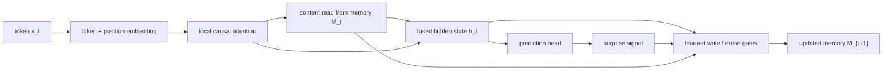
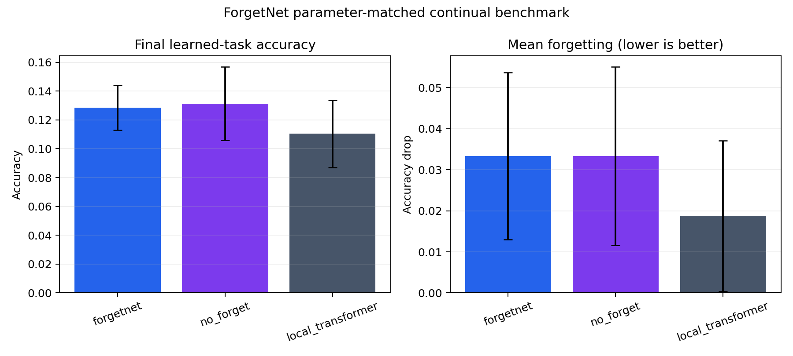

# ForgetNet


ForgetNet is a pure-PyTorch research repo for a contrarian sequence-modeling thesis:

> Long-context models should not only scale attention. They should learn what is worth remembering, when to overwrite stale facts, and when to forget.

The core model combines local causal attention with a fixed-size differentiable memory bank. At every token, the model reads from memory, estimates surprise, and updates memory slots through learned write and erase gates.

This is a serious v1 research implementation, not a state-of-the-art claim. The repo is built to make the idea easy to inspect, train, ablate, and falsify on controlled long-memory tasks.

**Core idea:** keep attention local, make memory bounded, and force the model to learn overwrite/forget behavior under controlled tests.

**Current artifact:** a three-seed, parameter-matched continual-learning pilot comparing ForgetNet, its no-forget ablation, and a local Transformer under equal update and evaluation budgets.

## Architecture



The banner above is a conceptual visual; the Mermaid graph and [technical note](docs/technical_note.md) are the source of truth for the implemented data flow and update equations.

## Install

```bash
uv sync
```

ForgetNet chooses devices in this order: CUDA, Apple Silicon MPS, then CPU.

## Quickstart

Train the plastic-memory model:

```bash
uv run forgetnet train --task changing_facts --model forgetnet --steps 100
```

Measure retention while tasks arrive sequentially:

```bash
uv run forgetnet continual \
  --tasks associative_lookup,changing_facts,needle_recall \
  --steps-per-task 100
```

Compare parameter-matched models across seeds:

```bash
uv run forgetnet benchmark \
  --models forgetnet,no_forget,local_transformer \
  --model-widths forgetnet=64,no_forget=64,local_transformer=48 \
  --seeds 2027,2028,2029 \
  --tasks associative_lookup,changing_facts,needle_recall \
  --steps-per-task 100
```

Evaluate all synthetic memory tasks:

```bash
uv run forgetnet eval --task all
```

Evaluate a trained checkpoint:

```bash
uv run forgetnet eval --checkpoint runs/<run>/checkpoint.pt --task all
```

Plot evaluation results:

```bash
uv run forgetnet plot --runs runs/ --output-dir results/
```

Plot a continual benchmark summary:

```bash
uv run forgetnet plot-benchmark \
  --summary runs/<benchmark>/benchmark_summary.json \
  --output-dir results/continual-benchmark
```

Run one interpretable example:

```bash
uv run forgetnet demo --task changing_facts
```

## Models

- `forgetnet`: local attention plus learned read/write/forget memory.
- `tiny_transformer`: compact Transformer baseline with the same answer-head contract.
- `local_transformer`: Transformer baseline restricted to a local attention window.
- `no_forget`: memory writes without learned erase gates.
- `no_surprise`: memory writes without surprise modulation.
- `random_write`: deterministic pseudo-random slot writes.
- `fifo_memory`: round-robin memory writes.

## Synthetic Memory Suite

- `associative_lookup`: read key-value pairs and answer the queried key.
- `changing_facts`: handle overwritten facts where the latest value wins.
- `needle_recall`: recall a sparse relevant pair among distractors.
- `multi_hop`: follow two edges, `A -> B -> C`.
- `length_extrapolation`: train short, evaluate longer associative lookup sequences.

## Outputs

Training writes:

```text
runs/<model-task-timestamp>/
  checkpoint.pt
  metrics.json
```

Evaluation writes:

```text
runs/eval-<timestamp>/
  metrics.json
```

Plotting writes:

```text
results/accuracy_by_task.png
results/plot_data.json
```

Continual benchmarking writes a seed-level CSV, aggregate JSON summary, full stage matrices, and final checkpoints. The checked compact artifact is in [`results/continual-benchmark`](results/continual-benchmark); large checkpoints remain ignored and reproducible from the documented command.

## Current Result

The checked CPU pilot uses three seeds, 100 updates per task, paired held-out batches, and models within a 1.064 largest/smallest parameter ratio. Mean final learned-task accuracy was 12.85% for ForgetNet, 13.13% for `no_forget`, and 11.04% for the local Transformer. Mean forgetting was 3.33%, 3.33%, and 1.88%, respectively.

The 95% intervals overlap. Paired `no_forget - forgetnet` accuracy was +0.28 ± 1.06 percentage points, so this run does **not** support the learned erase gate. ForgetNet's +1.81-point accuracy difference over the size-matched Transformer also remains inconclusive (paired 95% half-width 3.39 points). The Transformer was roughly 5x faster in this local implementation.

That is the useful result: the repo now has a protocol capable of falsifying the architectural thesis, and its first controlled pilot says the erase mechanism needs better evidence rather than stronger marketing.




## Tests

```bash
uv run pytest
```

The tests cover deterministic data generation, task label correctness, model output contracts, memory bounds, ablation construction, and CLI smoke flows.

## Research Positioning

ForgetNet is inspired by current work on test-time memory, associative memories, and long-context alternatives to full attention, including:

- [Titans: Learning to Memorize at Test Time](https://arxiv.org/abs/2501.00663)
- [Modern Hopfield Networks with Continuous-Time Memories](https://arxiv.org/abs/2502.10122)
- [MemMamba: Rethinking Memory Patterns in State Space Model](https://arxiv.org/abs/2510.03279)

The repo intentionally starts with synthetic tasks because they make memory behavior falsifiable. Real text modeling is a later step, after the write/forget mechanism survives controlled tests.

## Limitations

- The included experiments are small local sanity runs, not benchmark-scale claims.
- The checked continual pilot has only three seeds and synthetic tasks; intervals are descriptive normal approximations.
- Parameter counts are close, not exact, and equal update counts do not imply equal compute or wall time.
- The memory update is differentiable hidden state, not persistent weight editing.
- The synthetic tasks are diagnostic and can overstate real-world long-context ability.
- The architecture is designed for inspection and ablation before throughput.
